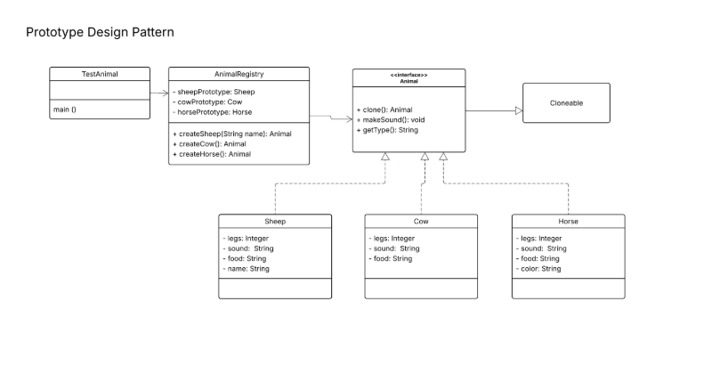

# Prototype Design Pattern

## Overview

The **Prototype Design Pattern** is a creational pattern that allows objects to be cloned rather than instantiated from scratch. This diagram illustrates the pattern using an animal registry example.

---

## Components

### `Cloneable` (Java Interface)
A built-in Java marker interface that enables object cloning.

---

### `<<interface>> Animal`
The core prototype interface. All concrete animals implement this. It extends `Cloneable` and declares three methods:
- `clone(): Animal` — returns a cloned copy of the object
- `makeSound(): void` — produces the animal's sound
- `getType(): String` — returns the animal's type identifier

---

### Concrete Prototypes

| Class | Attributes |
|-------|-----------|
| `Sheep` | `legs: Integer`, `sound: String`, `food: String`, `name: String` |
| `Cow` | `legs: Integer`, `sound: String`, `food: String` |
| `Horse` | `legs: Integer`, `sound: String`, `food: String`, `color: String` |

Each class implements the `Animal` interface and provides its own `clone()` implementation.

---

### `AnimalRegistry`
Acts as a **registry/cache** of pre-configured prototype instances. It holds:

**Prototype fields:**
- `sheepPrototype: Sheep`
- `cowPrototype: Cow`
- `horsePrototype: Horse`

**Factory methods** that clone the stored prototypes on demand:
- `createSheep(String name): Animal`
- `createCow(): Animal`
- `createHorse(): Animal`

---

### `TestAnimal`
The client class containing the `main()` entry point. It interacts with `AnimalRegistry` to obtain cloned animal instances without needing to know the concrete classes directly.

---

## How It Works

1. The `AnimalRegistry` is pre-loaded with prototype instances of each animal type.
2. When a client requests an animal, the registry **clones** the stored prototype instead of creating a new object.
3. The clone can then be customized (e.g., setting a sheep's `name`) before use.

This avoids the cost of re-initializing objects and decouples the client from concrete implementations.

UML CLASS DIAGRAM 
---

